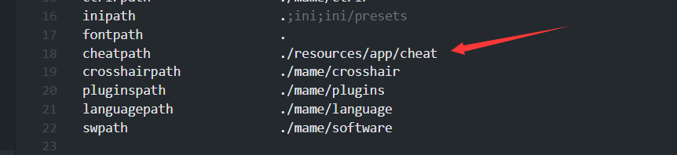
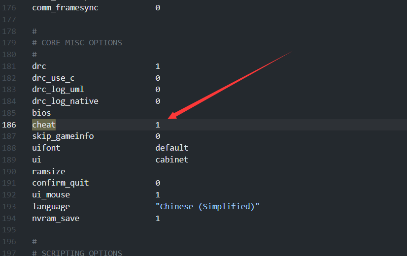
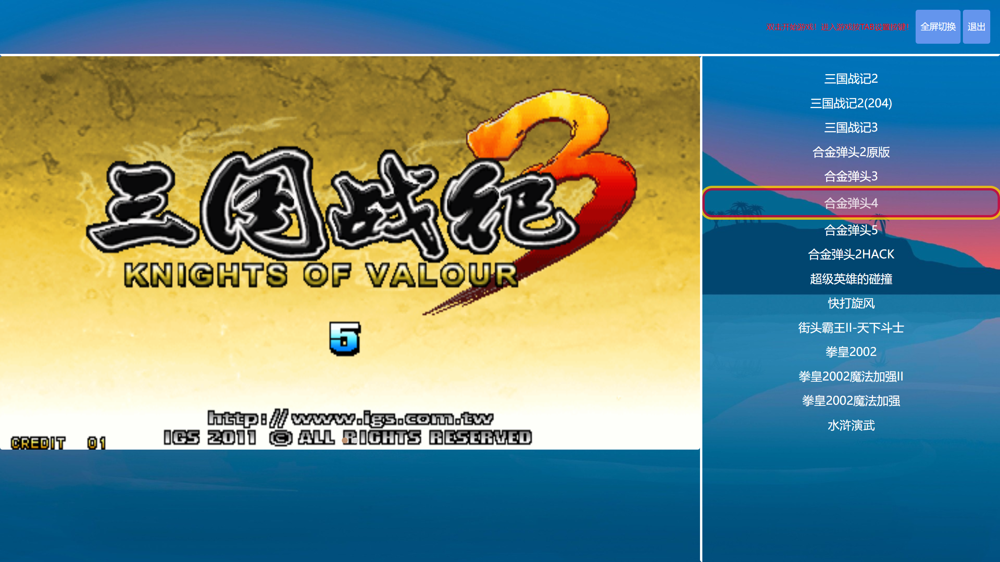

# MAME 小霸王

一款新的 MAME GUI 前端。

# 发行版下载地址（windows 64 位）

## 百度网盘

链接：https://pan.baidu.com/s/1IqKyRYeK3ZtUFZrpZ0piYw
提取码：qlgt
--来自百度网盘超级会员 V4 的分享

# 模拟器核心

MAME-0.237
https://www.mamedev.org/

# 使用教程

## 基础

- 解压运行 my-app.exe
- 双击右侧游戏名称运行游戏
- 上下左右，WSAD, 按键，J K U I
- 数字键 5 投币，数字键 1 开始
- F12:游戏快照

## 改建

游戏内按 TAB 键

## 添加游戏

- 1.下载对应的 rom 放到 /resources/app/roms 或 mame/roms/
- 2.编辑 /resources/app/src/roms.json 文件

```json
{
  "key": "kf2k2mp", //游戏rom名称
  "title": "拳皇2002魔法加强", //前端界面显示标题
  "describer": "拳皇2002魔法加强2" //游戏附加描述
}
```

## 金手指

- 修改根目录 mame.ini
- cheatpath ./resources/app/cheat
  
  

- 游戏按 TAB 呼出菜单，选中作弊选项

# 界面


